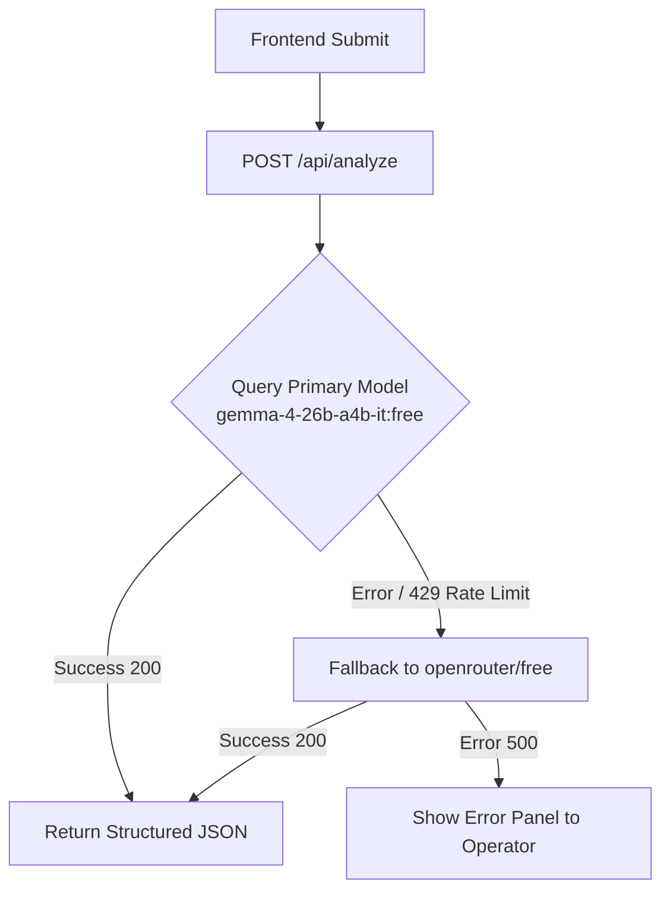

# Fleet Turnaround Assistant

An AI-powered, real-time vehicle turnaround assistant built with **Next.js**, **React**, and the **OpenRouter SDK**. It helps car rental fleet operators quickly analyze check-in conditions, calculate revenue impact, verify booking windows, generate action checklists, and decide if a vehicle is ready for its next trip.

## Features

- **Quick Return Check-in Form**: Input vehicle plates/nicknames, fuel levels, current mileage vs. last service mileage, and return notes.
- **Smart Turnaround Verdict**: Instant `GO`, `HOLD`, or `FLAG` decisions with detailed operator reasoning.
- **Time & Revenue Impact Calculation**: Calculates the financial cost of a delay based on the vehicle's Average Daily Rate (ADR).
- **Booking Window Feasibility Check**: Automatically totals estimated action times, compares them to the next booking window, warns the operator of tight/overflowing windows, and suggests items to skip if needed.
- **Urgency-based Action Items & Alerts**: Generates tasks prioritized by `NOW`, `BEFORE NEXT RENTAL`, or `THIS WEEK`, alongside severity-rated maintenance warnings.
- **Interactive Cleaning Checklist**: Displays visual prompts for flagged cleaning items.
- **Fleet Health Dashboard**: Persists local check-in histories in `localStorage` to compute a running health score per vehicle.
- **WhatsApp Summary Sharing**: Quick copy-to-clipboard button formatted for messaging team updates.
- **Robust AI Resiliency**: Automatically falls back to `openrouter/free` if the primary model (`google/gemma-4-26b-a4b-it:free`) faces rate limits or upstream provider errors.

---

## Tech Stack

- **Framework**: Next.js 16 (App Router)
- **Styling**: Pure CSS Modules (Dark brutalist aesthetic with orange highlights)
- **State Management**: React Hooks (`useState`, `useEffect`)
- **Backend API**: Secure Next.js Route Handler (`app/api/analyze/route.ts`)
- **AI Integration**: `@openrouter/sdk`

---

## Setup & Installation

### 1. Clone & Install Dependencies
```bash
git clone <your-repo-url>
cd fleetturnaroundmodule
npm install
```

### 2. Configure Environment Variables
Copy the `.env.example` file to create a `.env.local`:
```bash
cp .env.example .env.local
```

Open `.env.local` and add your secret **OpenRouter API Key**:
```env
# OpenRouter API Configuration
OPENROUTER_API_KEY=sk-or-v1-your-actual-api-key-here
OPENROUTER_MODEL=google/gemma-4-26b-a4b-it:free
```

> [!NOTE]  
> Because the app uses Next.js Route Handlers, your secret OpenRouter API Key remains safely on the server and is never exposed to the client browser.

---

## Running the Application

### Development Mode
To run the local development server:
```bash
npm run dev
```
Open [http://localhost:3000](http://localhost:3000) in your browser.

### Production Build
To verify TypeScript checks, build the optimized project, and run it:
```bash
npm run build
npm start
```

---

## Resilient AI Failover Design

To guarantee continuous operation in high-volume environments or when using free rate-limited models, the API route is configured with a **dual-model fallback strategy**:


